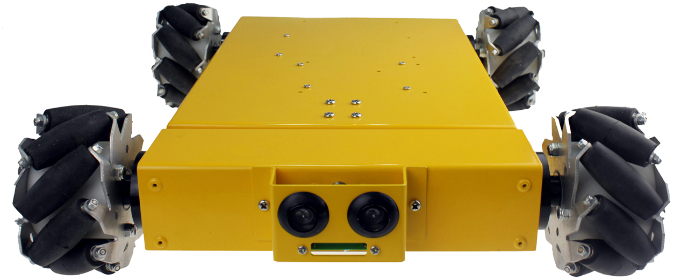

# ROS wheelbase controller for the NEXUS Omni 4-Wheeled Mecanum Robot



## Required hardware
This wheel controller has been developed for the 4WD Mecanum Wheel Mobile Arduino Robotics Car 10011 from [NEXUS ROBOT](https://www.nexusrobot.com/product/4wd-mecanum-wheel-mobile-arduino-robotics-car-10011.html)

For teleoperation of the Nexus wheelbase a (wireless) game pad like the Logitech F710 is recommended. The base controller runs on a PC or a Raspberry Pi 3B with ROS Melodic (-desktop) installed. To install  ROS Melodic on a Rasberry Pi, it is recommended to start with [Ubuntu MATE 18.04](https://ubuntu-mate.org/).

Logitech F710 | ROS Melodic
------------- | -----------
 |  

## Installing ROS dependencies
This project has been tested with ROS Melodic. The project uses an external C++ library. Clone the required PID_Library in the `nexus_base_ros/lib` directory:

 `git clone https://github.com/MartinStokroos/PID_Controller.git`
 
 The following ROS packages must be installed:

``` 
sudo apt-get install ros-melodic-rosserial-arduino
sudo apt-get install ros-melodic-rosserial
sudo apt-get install ros-melodic-joy
```

## Building the package
Place the package in the workspace *src* directory and run `catkin_make`from the root of the workspace.

## Generating the ros_lib for Arduino
It is possible to compile the Arduino firmware with the catkin make proces without making use of the Arduino IDE. However, now it is done with the Arduino IDE.
The Arduino IDE should be installed and the `Arduino/libraries` directory must exist in your home folder.
Generate the *ros_lib* with the header files of the custom message types used in this project.

1. cd into `Arduino/libraries`
2. type: `rosrun rosserial_arduino make_libraries.py .`

In the newly made `ros_lib` , edit `ros.h` and reduce the number of buffers and downsize the buffer sizes to save some memory space:

```
#elif defined(__AVR_ATmega328P__)

  //typedef NodeHandle_<ArduinoHardware, 25, 25, 280, 280> NodeHandle;
  typedef NodeHandle_<ArduinoHardware, 8, 8, 128, 128> NodeHandle;
```

## Flashing the firmware into the wheel controller board of the 10011 platform
* download and include the digitalWriteFast Arduino library from: [digitalwritefast](https://code.google.com/archive/p/digitalwritefast/downloads)
* clone and install the PinChangeInt library: `https://github.com/MartinStokroos/PinChangeInt`

Program the *Nexus_Omni4WD_Rosserial.ino* sketch from the firmware folder into the Arduino  Duemilanove-328 based controller board from the 10011 platform.

**NOTE:** The Sonars cannot be used simultaneously with the serial interface and must be disconnected permanently!

## Description
The picture below shows the rosgraph output from `rqt_graph`:


* Topics

The *nexus_base_controller* node runs on the platform computer and listens to the *cmd_vel* topic and uses the x-, y and angular velocity inputs. The *cmd_vel* is from the geometry_msg Twist  type.
The *nexus_base_controller* node publishes odometry data based on the wheel encoder data, with the topic name *sensor_odom*.

*nexus_base* is a rosserial type node running on the wheelbase controller board. The code for this node can be found in the firmware directory. *nexus_base* listens to the *cmd_motor* topic and publishes the *wheel_vel* topic at a constant rate of 20Hz (default).
The data structure of the *cmd_motor* topic is a 4-dim. array of *Int16*'s. The usable range is from -255 to 255 and it represents the duty-cycle of the PWM signals to the motors. Negative values  reverses the direction of rotation.
The *wheel_vel* topic data format is also a 4-dim. array of *Int16*'s.
 
*wheel_vel* is the raw wheel speed and that is the number of encoder increments/decrements per sample interval (0.05s default).
Three seconds after receiving a speed (x,y and angular) of '0' the motors are set idle to save power by stopping the PWM.

*/joy* is the standard message topic from the joystick node. The *teleop_joy* node does the unit scaling and publishes the *cmd_vel* topic. It also contains the service clients of the ROS services *EmergencyStopEnable* and *ArmingEnable*.

* Services

Node *nexus_base* runs two ROS service servers. The first service is called *EmergencyStopEnable* and enables the emergency stop and the second service is called *ArmingEnable* and this service is to rearm the system.

* Block diagram of the Nexus base controller

The blockdiagram shows the internal structure of the *nexus_base_controller* node.


## Launching the example project
The tele-operation demo can be launched after connecting a game pad (tested with *Logitech F710*) and the wheel base USB-interface with the platform computer (small formfactor PC or Raspberry Pi 3B). Check if the game pad is present by typing:

`ls -l /dev/input/js0`

Check if the wheel base USB interface is present: 

`ls -l /dev/ttyUSB0`

Launch:

`rosrun nexus_base_ros nexus_teleop_joy `

The left joystick handle steers the angular velocity when moved from left to right. The right joystick controls the x- and y-speed.
The red button enables the emergency stop. The green button is to rearm the robot after an emergency stop.

Some diagnostics:

```
$ rostopic list
/cmd_motor
/cmd_vel
/diagnostics
/joy
/joy/set_feedback
/rosout
/rosout_agg
/sensor_odom
/wheel_vel

$ rosservice list
/arming_enable
/base_controller/get_loggers
/base_controller/set_logger_level
/emergency_stop_enable
/joystick/get_loggers
/joystick/set_logger_level
/nexus_base/get_loggers
/nexus_base/set_logger_level
/rosout/get_loggers
/rosout/set_logger_level
/teleop_joy/get_loggers
/teleop_joy/set_logger_level

$ rostopic hz /wheel_vel 
subscribed to [/wheel_vel]
average rate: 20.010
	min: 0.047s max: 0.064s std dev: 0.00505s window: 40
```
## Auto-start from boot
The script to bringup the robot when booting the PC/RPi can be generated with the *robot_upstart* package.

`sudo apt-get install ros-melodic-robot-upstart`

Create the install script(s) (run from catkin workspace):

`rosrun robot_upstart install nexus_base_ros/launch/nexus_teleop_joy.launch`

`sudo systemctl daemon-reload && sudo systemctl start nexus`

One last thing to do, is giving perimission for using the serial port at boot. 

```
cd /etc/udev/rules.d
sudo touch local.rules
```

edit local.rules

```
ACTION=="add", KERNEL=="dialout", MODE="0666"
ACTION=="add", KERNEL=="js0", MODE="0666"	//to be confirmed if really needed.
ACTION=="add", KERNEL=="ttyUSB0", MODE="0666"
```

The script can be enabled/disabled by:

`sudo systemctl nexus start`

`sudo system ctl nexus stop`

If needed, check the upstart log with:

`sudo journalctl -u nexus`

Uninstalling the script can be done with:

`rosrun robot_upstart uninstall nexus`

## Known issues
When building the package for the first time, the following error may appear:

```
fatal error: nexus_base_ros/Encoders.h: No such file or directory
 #include "nexus_base_ros/Encoders.h"
          ^~~~~~~~~~~~~~~~~~~~~~~~~~~
compilation terminated.
```

The reason for this could be that there is something wrong in the sequence of instructions in the *CMakeList.txt* file. It could also be that the build of some dependencies are not finished before linking because the make proces is threaded. For the moment the workaround is:

```
cd build/
make -j4 nexus_base_ros
cd ..
catkin_make
```

#

ROS service calls do not work with rosserial 0.8.0. ROS Melodic comes with rosserial version 0.8.0. Rosserial 0.7.7 works. Workaround:
Download [rosserial 0.7.7](https://repology.org/project/rosserial/packages) . Unzip and copy the following module from the rosserial-0.7.7 package into the catkin *src* directory and rebuild the project:

`rosserial_python` 

#

Sometimes the wheels do not respond for a short moment when the robot is rearmed after an emergency stop.
 